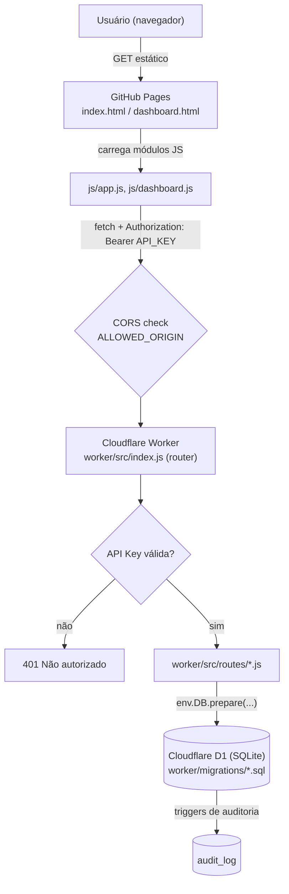
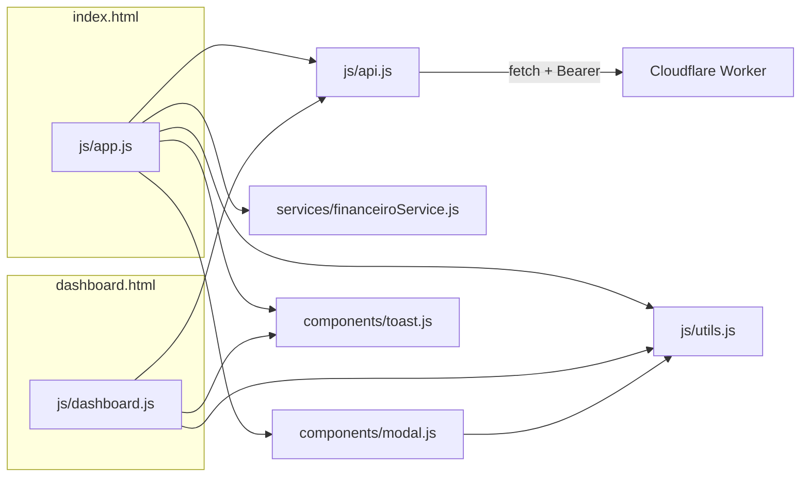
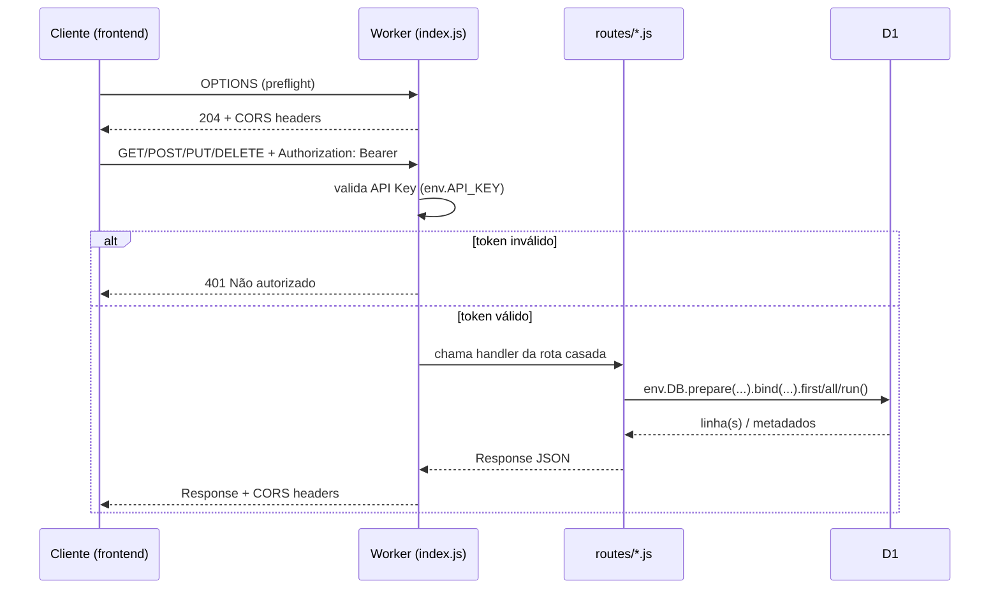
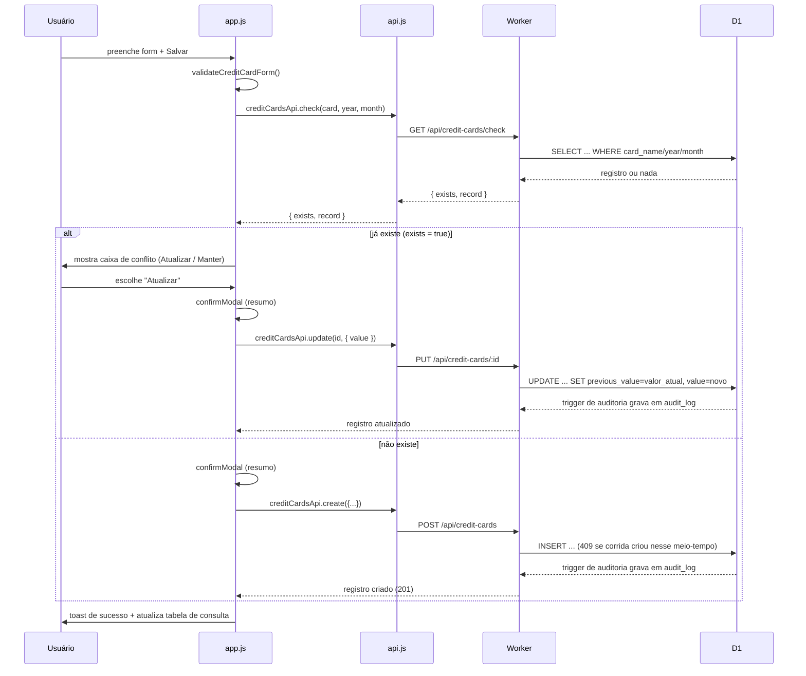

# Arquitetura

> Ordem de leitura sugerida: [CLAUDE.md](../CLAUDE.md) → [SESSION_SUMMARY.md](SESSION_SUMMARY.md) → **este arquivo**.

## 1. Visão geral

O CloudFinance é composto por três partes independentes, que só se comunicam
por HTTP:

1. **Frontend estático** (`index.html`, `dashboard.html`, `js/`, `css/`,
   `components/`, `services/`) — hospedado no GitHub Pages. Não tem servidor
   próprio: é HTML/CSS/JS puro servido como arquivo estático.
2. **API** (`worker/src/`) — roda em Cloudflare Workers (serverless, edge).
   Não é publicada no GitHub Pages.
3. **Banco de dados** (`worker/migrations/`) — Cloudflare D1 (SQLite gerenciado
   pela Cloudflare), acessado exclusivamente pelo Worker via binding `env.DB`.



Não há servidor de aplicação tradicional: o "backend" é uma função `fetch`
sem estado (`worker/src/index.js`), reinstanciada a cada requisição pela
Cloudflare — não há sessão, cache em memória entre requisições, nem
filas/workers em background.

## 2. Estrutura de pastas e responsabilidades

```
CloudFinance/
├─ index.html              # Página "Cadastro de Despesas" (formulários)
├─ dashboard.html           # Página "Dashboard Financeiro" (cards + gráficos)
├─ css/style.css            # Estilos complementares ao Bootstrap 5
├─ js/
│  ├─ api.js                 # Único ponto de comunicação com a API (fetch + Bearer token)
│  ├─ utils.js                # Formatação (moeda BRL, datas), máscaras de input, helpers de <select>
│  ├─ app.js                  # Orquestra index.html: liga formulários → services → api → components
│  └─ dashboard.js             # Orquestra dashboard.html: busca dados, renderiza cards/gráficos (Chart.js)
├─ components/
│  ├─ modal.js               # Modais reutilizáveis (Bootstrap): confirmação, novo tipo, gerenciar tipos, editar registro
│  └─ toast.js                # Notificações toast (Bootstrap)
├─ services/
│  └─ financeiroService.js    # Regras de negócio puras: validação de formulários, cálculo de Vale-Transporte
├─ assets/icons/             # Reservado para ícones customizados (hoje vazio — usa Bootstrap Icons via CDN)
├─ worker/                   # API — Cloudflare Workers (NÃO publicado no GitHub Pages)
│  ├─ src/index.js             # Router + autenticação (API Key) + CORS + tratamento central de erros
│  ├─ src/utils.js              # Helpers HTTP (jsonResponse, HttpError) e validação (assertYear, assertMonth, ...)
│  ├─ src/routes/*.js           # Um arquivo por recurso da API (CRUD + regras específicas)
│  ├─ migrations/*.sql          # Schema versionado do D1 (histórico completo, nunca editado retroativamente)
│  ├─ wrangler.toml             # Config do Worker (binding D1, ALLOWED_ORIGIN)
│  ├─ package.json              # Única dependência: wrangler (CLI de dev/deploy)
│  └─ API.md                    # Redireciona para docs/API_REFERENCE.md (fonte única)
├─ .gitignore
├─ README.md                 # Porta de entrada para humanos (instalação, deploy) — não duplica docs/
├─ CLAUDE.md                 # Contexto rápido para sessões de IA
└─ docs/                     # Documentação técnica completa (este diretório)
```

**Responsabilidade por diretório**, em uma frase cada:

- `js/` — orquestração de UI e comunicação com a API; não tem regra de negócio.
- `components/` — widgets de interface reutilizáveis, sem conhecimento de
  domínio financeiro (recebem dados prontos via parâmetros/callbacks).
- `services/` — regra de negócio pura (validação, cálculo), sem DOM e sem
  chamadas de API — testável isoladamente.
- `worker/src/routes/` — um arquivo por recurso REST; cada handler faz
  validação de entrada, consulta/grava no D1 e devolve JSON.
- `worker/migrations/` — histórico imutável do schema; a "fonte da verdade"
  do banco é sempre o **conjunto de migrations aplicadas em ordem**, nunca um
  dump único.

## 3. Frontend

### 3.1 Módulos e dependências



- **`js/api.js`** — único módulo que conhece a URL base e a API Key
  (`API_BASE_URL`, `API_KEY`, ambas no topo do arquivo). Exporta um objeto por
  recurso (`creditCardsApi`, `fixedExpensesApi`, `avistaPaymentsApi`,
  `funcionariaPaymentsApi`, `expenseTypesApi`, `avistaExpenseTypesApi`,
  `funcionariaExpenseTypesApi`, `dashboardApi`), cada um com `list/create/
  update/remove` (e `getById`/`check` quando aplicável). Erros HTTP viram uma
  `ApiError` com `.message` pronta para exibir em toast.
- **`js/utils.js`** — puramente utilitário: `formatCurrencyBRL`,
  `parseCurrencyInput`, `attachCurrencyMask` (máscara de moeda em tempo real),
  `formatDateOnlyBR`/`formatDateTimeBR`, `populateYearSelect`/
  `populateMonthSelect`, `debounce`. Não depende de `api.js`.
- **`js/app.js`** — orquestra `index.html`. Uma função `initXxxSection()` por
  seção do formulário (Cartões, Despesas Fixas, Pagamentos à Vista/PIX,
  Funcionária) + `initQuerySection()` para a área de consulta/edição. Cada
  submit: valida (`services/financeiroService.js`) → confirma
  (`components/modal.js`) → chama a API → mostra toast → atualiza a tabela de
  consulta.
- **`js/dashboard.js`** — orquestra `dashboard.html`. Busca
  `dashboardApi.get(year)` e `dashboardApi.lastUpdate()`, renderiza os 2 cards
  e os 2 gráficos de barra (Chart.js), com alternância gráfico/tabela.
- **`components/modal.js`** — 5 modais Bootstrap reutilizáveis:
  `confirmModal`, `newExpenseTypeModal`, `manageExpenseTypesModal`,
  `editRecordModal` (genérico, campos dirigidos por `fields[]`), `infoModal`.
  Contém um workaround documentado para uma race condition do Bootstrap
  (`hideModal`/`markModalAsShown` — ver comentário no próprio arquivo).
- **`components/toast.js`** — `showToast(message, type)`, wrapper fino sobre
  `bootstrap.Toast`.
- **`services/financeiroService.js`** — validação de cada formulário
  (`validateCreditCardForm`, `validateFixedExpenseForm`,
  `validateFuncionariaPaymentForm`) e o cálculo de Vale-Transporte
  (`calcularValeTransporte`). Não importa `api.js` nem toca no DOM.

### 3.2 Páginas

| Página | Papel |
|---|---|
| `index.html` | Cadastro: 4 formulários de lançamento (Cartões, Despesas Fixas, Pagamentos à Vista/PIX, Funcionária) + seção "Consultar e Editar Lançamentos" |
| `dashboard.html` | 2 cards de previsão (próximo mês), 2 gráficos de barra Jan-Dez (total geral e só cartões), filtro por ano, timestamp da última atualização |

Sem roteamento client-side — são duas páginas HTML estáticas distintas,
navegação por link `<a href>` comum.

## 4. Backend (Worker)

### 4.1 Roteamento

`worker/src/index.js` implementa um roteador manual, sem framework, em três
listas:

- `STATIC_ROUTES` — rotas sem parâmetro (`GET/POST /api/credit-cards`, etc.).
- `ID_ROUTES` — rotas com `:id` numérico no final do path (`GET/PUT/DELETE
  /api/credit-cards/123`), casadas por prefixo + regex `^\d+$`.
- `ACTION_ROUTES` — reservada para futuras rotas `POST /recurso/:id/acao`;
  **hoje vazia** (nenhuma rota de ação implementada ainda).

Fluxo de uma requisição (`handleRequest`):



Erros lançados como `HttpError` (definida em `src/utils.js`) são capturados
centralmente em `export default { fetch }` e convertidos em JSON
`{ "error": mensagem }` com o status correto; qualquer outra exceção vira
`500 Erro interno no servidor.` (logada via `console.error`).

### 4.2 Padrão de cada arquivo de rota

Todo arquivo em `worker/src/routes/` segue a mesma forma (CRUD):

```
list<Recurso>(request, env, url)      → GET  /api/recurso[?year=]
create<Recurso>(request, env)         → POST /api/recurso
get<Recurso>(request, env, id)        → GET  /api/recurso/:id      (quando aplicável)
update<Recurso>(request, env, id)     → PUT  /api/recurso/:id
delete<Recurso>(request, env, id)     → DELETE /api/recurso/:id
```

Recursos com lançamento em lote (Despesas Fixas, Pagamentos à Vista/PIX,
Funcionária) recebem `months: number[]` no `create` e geram uma linha por mês,
todas com o mesmo `batch_id` (`crypto.randomUUID()`), verificando conflitos
mês a mês **antes** de inserir qualquer linha (tudo ou nada lógico, embora não
seja uma transação SQL explícita — ver [KNOWN_ISSUES.md](KNOWN_ISSUES.md)).

Detalhes de cada endpoint: [API_REFERENCE.md](API_REFERENCE.md).
Regras de negócio por trás de cada rota: [BUSINESS_RULES.md](BUSINESS_RULES.md).

### 4.3 `worker/src/utils.js`

Helpers compartilhados por todas as rotas:

- `jsonResponse` / `errorResponse` — padroniza `Content-Type` e o corpo JSON.
- `HttpError` — exceção com `.status` HTTP, capturada centralmente.
- `parseJsonBody` — parse seguro do corpo (lança `400` em JSON malformado).
- `requireFields` — checa campos obrigatórios presentes/não-vazios (`422`).
- `assertNonNegativeNumber` / `assertMonth` / `assertYear` — validação +
  coerção de tipo, usadas por toda rota que recebe valor/mês/ano.
- `monthName` — nomes de mês em pt-BR (duplicado intencionalmente em
  `js/utils.js` do frontend — ver [CONVENTIONS.md](CONVENTIONS.md)).

## 5. Banco de dados

Ver detalhamento completo (schema atual, diagrama ER, migrations,
justificativas) em [DATABASE.md](DATABASE.md). Resumo:

- Cloudflare D1 (SQLite), schema aplicado via `wrangler d1 migrations apply`.
- 8 tabelas ativas hoje: `credit_cards`, `expense_types`, `fixed_expenses`,
  `audit_log`, `funcionaria_expense_types`, `funcionaria_pagamentos`,
  `avista_expense_types`, `avista_payments`.
- Todo lançamento (não as taxonomias de tipo) tem `created_at`/`updated_at` e
  alimenta `audit_log` via triggers `AFTER INSERT/UPDATE/DELETE`.
- Migrations 0002–0006 documentam um módulo inteiro (Folha de Pagamento) que
  foi criado e depois removido — histórico relevante, ver
  [DECISIONS.md](DECISIONS.md) ADR-003.

## 6. Fluxo de dados — exemplo completo (Cartão de Crédito com conflito)



## 7. Decisões arquiteturais relevantes

Ver [DECISIONS.md](DECISIONS.md) para o histórico completo em formato ADR.
Destaques: arquitetura estática + serverless (ADR-001), API Key única
embutida no frontend (ADR-002), remoção do módulo de Folha de Pagamento
(ADR-003), taxonomias de tipo independentes por seção (ADR-004).
