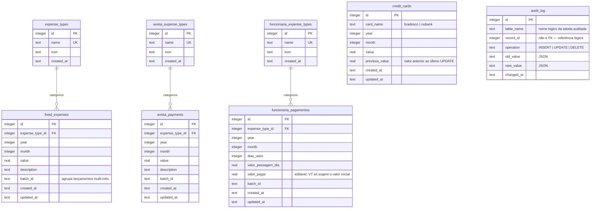

# Banco de Dados

> Banco: Cloudflare D1 (SQLite). Schema versionado em `worker/migrations/`.
> Este documento reflete o **schema atual** (após todas as migrations
> `0001`–`0011`) — o código/migrations é a fonte da verdade; se este arquivo
> divergir do conteúdo de `worker/migrations/`, as migrations prevalecem.

## 1. Diagrama ER (schema atual)

`audit_log` não tem chave estrangeira formal para as demais tabelas — é
identificada por `(table_name, record_id)`, e continua existindo mesmo depois
que o registro original é apagado (histórico de DELETE).

## 2. Tabelas ativas

### 2.1 `credit_cards`
Uma fatura por `(card_name, year, month)`. `card_name` restrito a `bradesco`/
`nubank` via `CHECK`. `previous_value` guarda o valor anterior ao último
`UPDATE`, usado pela interface para mostrar "último valor registrado".

- `UNIQUE (card_name, year, month)`
- `CHECK (card_name IN ('bradesco','nubank'))`
- `CHECK (value >= 0)`, `CHECK (previous_value IS NULL OR previous_value >= 0)`
- Índice: `idx_credit_cards_year_month (year, month)`
- Auditada (INSERT/UPDATE/DELETE → `audit_log`)

### 2.2 `expense_types`
Taxonomia de tipos de despesa usada exclusivamente por **Despesas Fixas**.
`name` único. Seed inicial com 10 categorias comuns (Aluguel, Energia, Água...).
**Não é auditada** (sem triggers).

### 2.3 `fixed_expenses`
Lançamentos de Despesas Fixas. `batch_id` agrupa linhas criadas na mesma
operação (seleção de vários meses de uma vez).

- `UNIQUE (expense_type_id, year, month)`
- `expense_type_id` → `expense_types.id` (`ON DELETE RESTRICT`)
- `CHECK (value >= 0)`
- Índices: `idx_fixed_expenses_year_month`, `idx_fixed_expenses_type`
- Auditada

### 2.4 `avista_expense_types`
Taxonomia própria de **Pagamentos à Vista/PIX** — independente de
`expense_types`. Não auditada.

### 2.5 `avista_payments`
Lançamentos de Pagamentos à Vista/PIX. Estrutura idêntica a
`fixed_expenses`, apontando para `avista_expense_types`.

- `UNIQUE (expense_type_id, year, month)`
- `expense_type_id` → `avista_expense_types.id` (`ON DELETE RESTRICT`)
- `CHECK (value >= 0)`
- Índices: `idx_avista_payments_year_month`, `idx_avista_payments_type`
- Auditada

### 2.6 `funcionaria_expense_types`
Taxonomia própria da seção **Funcionária — Pagamento Mensal** — independente
das duas anteriores. Não auditada.

### 2.7 `funcionaria_pagamentos`
Pagamento mensal da funcionária. `dias_uteis` × `valor_passagem_dia` é o
cálculo de Vale-Transporte (Lei 7.418/1985) que **sugere** o valor de
`valor_pagar` no frontend — a coluna armazena o valor final, que pode ter
sido ajustado manualmente.

- `UNIQUE (expense_type_id, year, month)`
- `expense_type_id` → `funcionaria_expense_types.id` (`ON DELETE RESTRICT`)
- `CHECK (valor_pagar >= 0)`, `CHECK (dias_uteis >= 0)`, `CHECK (valor_passagem_dia >= 0)`
- Índices: `idx_funcionaria_pagamentos_year_month`, `idx_funcionaria_pagamentos_type`
- Auditada
- **Não tem coluna `description`** (removida na migration 0010).

### 2.8 `audit_log`
Histórico genérico de alterações, alimentado por triggers em
`credit_cards`, `fixed_expenses`, `avista_payments` e `funcionaria_pagamentos`.
Sem endpoint de API — consulta apenas via `wrangler d1 execute` (ver
[DEPLOY.md](DEPLOY.md)).

- Índices: `idx_audit_log_table_record (table_name, record_id)`,
  `idx_audit_log_changed_at (changed_at)`

## 3. Triggers

Todas as tabelas de lançamento (não as de taxonomia) têm 3 triggers
`AFTER INSERT/UPDATE/DELETE` que gravam em `audit_log`:

| Tabela | Triggers |
|---|---|
| `credit_cards` | `trg_credit_cards_audit_{insert,update,delete}` |
| `fixed_expenses` | `trg_fixed_expenses_audit_{insert,update,delete}` |
| `avista_payments` | `trg_avista_payments_audit_{insert,update,delete}` |
| `funcionaria_pagamentos` | `trg_funcionaria_pagamentos_audit_{insert,update,delete}` |

Nenhuma tabela de tipo (`expense_types`, `avista_expense_types`,
`funcionaria_expense_types`) tem trigger de auditoria — renomear/excluir um
tipo não fica registrado (ver [KNOWN_ISSUES.md](KNOWN_ISSUES.md)).

**Decisão importante:** `updated_at` é sempre setado explicitamente pela
aplicação (SQL de `UPDATE ... SET updated_at = strftime(...)`), nunca por um
trigger de "auto-touch". Um trigger desse tipo foi testado e descartado: no
runtime do D1 ele fazia o trigger de auditoria disparar duas vezes para a
mesma alteração, duplicando entradas no `audit_log` (comentário original em
`worker/migrations/0001_init.sql`; decisão registrada em
[DECISIONS.md](DECISIONS.md) ADR-005).

## 4. Linha do tempo das migrations

| # | Arquivo | Resumo | Data (aprox.) |
|---|---|---|---|
| 0001 | `0001_init.sql` | Schema inicial: `credit_cards`, `employee_monthly`, `employee_advances`, `expense_types`, `fixed_expenses`, `audit_log` + triggers + seed de tipos | 2026-07-15 |
| 0002 | `0002_drop_employee_features.sql` | Remove `employee_monthly` e `employee_advances` (cadastro de Funcionária/Adiantamentos removido do frontend) | 2026-07-16 |
| 0003 | `0003_payroll_module.sql` | Cria módulo completo de Folha de Pagamento — Empregada Doméstica (`funcionarios`, `rubricas`, `parametros_legais`, `folha_pagamento`, `folha_rubricas`, `folha_lancamentos_financeiros`) | 2026-07-17 |
| 0004 | `0004_simplify_funcionarios.sql` | Torna CPF/NIS/admissão/cargo/dependentes opcionais em `funcionarios` (rebuild da tabela) | 2026-07-17 |
| 0005 | `0005_update_legal_parameters.sql` | Insere nova versão de `parametros_legais` (competência 2025-01), conferida contra o eSocial real | 2026-07-17 |
| 0006 | `0006_remove_payroll_module.sql` | **Remove por completo** o módulo de Folha de Pagamento (0003–0005) a pedido do usuário | 2026-07-17 |
| 0007 | `0007_add_funcionaria_payments.sql` | Recria seção Funcionária, agora simples (`funcionaria_pagamentos`, formato "lançamento" tipo Despesas Fixas) | 2026-07-17 |
| 0008 | `0008_funcionaria_payments_use_expense_type.sql` | Substitui `nome`/`salario` por `expense_type_id` (compartilhando `expense_types` neste momento); passa a representar só o VT | 2026-07-17 |
| 0009 | `0009_funcionaria_own_expense_types.sql` | Cria `funcionaria_expense_types` própria; para de compartilhar `expense_types` com Despesas Fixas | 2026-07-17 |
| 0010 | `0010_funcionaria_editable_value.sql` | Renomeia `valor_vt` → `valor_pagar` (editável); remove coluna `description` | 2026-07-20 |
| 0011 | `0011_add_avista_payments.sql` | Adiciona seção Pagamentos à Vista/PIX (`avista_expense_types`, `avista_payments`), taxonomia própria desde o início | 2026-07-21 |

Contexto e justificativa completos de cada mudança estrutural: ver
[DECISIONS.md](DECISIONS.md) e [CHANGELOG.md](CHANGELOG.md).

## 5. Tabelas removidas (histórico, não existem mais)

Mantidas aqui apenas como referência — **não recriar sem pedido explícito**:

- `employee_monthly`, `employee_advances` — cadastro antigo de funcionária
  (dropadas na 0002).
- `funcionarios`, `rubricas`, `parametros_legais`, `folha_pagamento`,
  `folha_rubricas`, `folha_lancamentos_financeiros` — módulo de Folha de
  Pagamento com motor de cálculo de INSS/IRRF/FGTS/eSocial (dropadas na 0006).

## 6. Justificativas de design

- **`REAL` para valores monetários** (não inteiro em centavos): SQLite não
  tem tipo `DECIMAL` nativo; o projeto aceita a imprecisão de ponto flutuante
  dado o volume/uso pessoal. O frontend arredonda para 2 casas em
  `calcularValeTransporte` (`Math.round(x * 100) / 100`).
- **Taxonomias de tipo independentes por seção** (`expense_types` /
  `avista_expense_types` / `funcionaria_expense_types`): evita que a lista de
  categorias de uma seção "vaze" para outra sem relação (ver ADR-004).
- **`audit_log` genérico** (uma tabela para todas as entidades, com
  `table_name`/`record_id`/JSON) em vez de uma tabela de histórico por
  entidade: menos schema para manter, à custa de não ter FK real — aceitável
  porque é só para consulta manual, sem uso na aplicação.
- **Sem paginação nas listagens** (`GET /api/fixed-expenses` retorna tudo):
  aceitável no volume atual (uso pessoal, poucos anos de histórico); revisar
  se o volume crescer (ver [KNOWN_ISSUES.md](KNOWN_ISSUES.md)).
