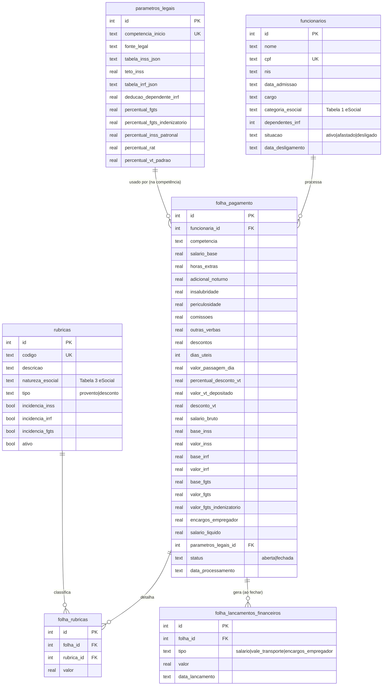
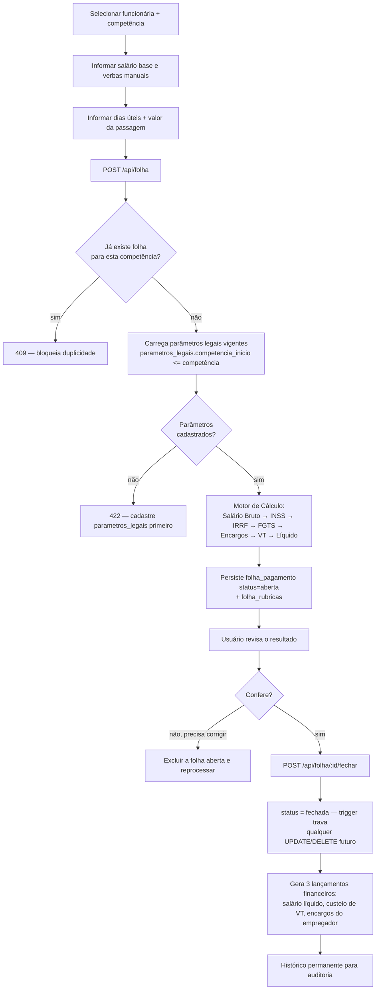

# Módulo de Folha de Pagamento — Empregada Doméstica

Documentação técnica do módulo de processamento de folha, aderente ao
**eSocial Doméstico**, à **Lei Complementar nº 150/2015** (Estatuto do
Trabalhador Doméstico), à CLT (aplicação subsidiária) e à legislação
previdenciária/tributária vigente.

> **Este módulo não é um substituto de contador/profissional de RH.** As
> tabelas legais seguem parametrizadas (`parametros_legais`) exatamente para
> permitir atualização sem alterar código — mas os *valores* semeados na
> migration são os últimos que puderam ser confirmados com segurança neste
> momento (vigência a partir de 01/2024). **Confira e atualize antes de
> processar folha real** (ver seção "Atualização anual" abaixo).

## 1. Escopo e não-escopo

O módulo processa a folha, calcula encargos/descontos/benefícios, registra o
financeiro e mantém histórico. Ele **não** cadastra funcionários além do
mínimo de identificação exigido para referenciar a folha (`funcionaria_id`),
**não** calcula automaticamente horas extras, adicional noturno,
insalubridade, periculosidade, comissões ou outras verbas variáveis — todas
são informadas manualmente pelo usuário, conforme especificado.

## 2. Arquitetura

```
worker/src/
├─ domain/                          # Regra de negócio pura — sem SQL, sem HTTP
│  ├─ money.js                       # arredondamento monetário
│  ├─ vtCalculator.js                 # Vale-Transporte (Lei 7.418/1985)
│  ├─ inssCalculator.js                # INSS empregado (progressivo, EC 103/2019)
│  ├─ irrfCalculator.js                # IRRF (Lei 9.250/1995)
│  ├─ fgtsCalculator.js                # FGTS 8% + indenizatório 3,2% (LC 150/2015)
│  ├─ encargosEmpregadorCalculator.js  # INSS patronal + RAT (LC 150/2015, Lei 8.212/1991)
│  └─ folhaCalculationEngine.js        # Orquestra os módulos acima
├─ routes/
│  ├─ funcionarios.js                 # Identificação mínima (não é RH completo)
│  ├─ rubricas.js                      # Tabela de Rubricas (conceito S-1010)
│  ├─ parametrosLegais.js              # Tabelas legais por competência
│  └─ folha.js                         # Processar / Fechar / Consultar + integração financeira
```

Cada camada tem uma única responsabilidade (SRP): `domain/` nunca acessa
`env.DB`; `routes/` nunca calcula (apenas carrega dados, chama o `domain` e
persiste o resultado). Isso permite testar o motor de cálculo isoladamente
(ver seção 8) e trocar a camada de persistência no futuro sem tocar em
nenhuma regra tributária.

## 3. Modelo de dados (ERD)



`audit_log` (já existente no sistema, migration 0001) recebe automaticamente
o histórico de INSERT/UPDATE/DELETE de `folha_pagamento` e `funcionarios` via
triggers — nenhuma tabela de auditoria nova foi necessária.

## 4. Base legal de cada cálculo

| Cálculo | Base legal | Observação de implementação |
|---|---|---|
| VT — benefício | Lei 7.418/1985, art. 4º | `dias_uteis × valor_passagem_dia`; não integra remuneração/bases |
| VT — desconto | Decreto 95.247/1987, art. 32 | Limite = 6% (parametrizável) do **salário básico** — não do bruto (ver nota abaixo) |
| INSS empregado | Lei 8.212/1991 art. 20 + EC 103/2019 | Cálculo **progressivo por faixas** (não mais alíquota única) |
| Teto INSS | Lei 8.212/1991, art. 28, §5º | Aplica-se somente à contribuição do segurado, não ao patronal |
| IRRF | Lei 9.250/1995, arts. 3º, 4º, 7º | Base = tributável − INSS − (dependentes × dedução) − pensão |
| FGTS | Lei 8.036/1990, art. 15 | 8% sobre a remuneração |
| FGTS indenizatório | LC 150/2015, art. 22 | 3,2% — exclusivo do doméstico, substitui a multa rescisória à vista |
| INSS patronal | LC 150/2015, art. 24, I | 8% — sem teto (diferente do empregado) |
| RAT doméstico | Lei 8.212/1991, art. 22-A | 0,8% fixo (não varia por grau de risco como nas empresas) |

### Nota importante sobre o Vale-Transporte

O enunciado original deste projeto exemplificava o limite legal como
`Salário Bruto × 6%`. **A lei diz "salário básico"** (Decreto 95.247/1987,
art. 32), não o bruto com adicionais/horas extras. Como instruído a
priorizar a legislação vigente sobre convenções de mercado sempre que
houver conflito, o motor de cálculo usa `salario_base` (o campo puro,
sem horas extras/adicionais) como base do limite de 6%. No exemplo do
enunciado (salário-base = R$ 2.000, sem outras verbas) o resultado é
idêntico (R$ 120,00); a diferença só aparece quando há horas extras,
adicionais etc. somados ao salário base.

## 5. Fluxo de processamento



## 6. Integração financeira (ao fechar a folha)

| Tipo | Valor | Composição |
|---|---|---|
| `salario` | `salario_liquido` | Bruto − INSS − IRRF − descontos diversos − desconto VT |
| `vale_transporte` | `valor_vt_depositado − desconto_vt` | Custo que efetivamente sobra para o empregador (a parte descontada já reduziu o líquido acima, evitando dupla contagem) |
| `encargos_empregador` | `encargos_empregador + valor_fgts + valor_fgts_indenizatorio` | Todo o custo patronal adicional (INSS patronal + RAT + FGTS + FGTS indenizatório) — corresponde ao valor pago na guia DAE do Simples Doméstico, exceto a parte que é retenção do próprio empregado (já contabilizada no salário) |

Os três lançamentos ficam vinculados a `folha_id` em
`folha_lancamentos_financeiros` — não são somados aos totais do Dashboard
Financeiro nesta versão (o Dashboard consulta apenas `credit_cards` e
`fixed_expenses`); trata-se de um ledger próprio do módulo de folha, íntegro
para fins de auditoria. Uma futura integração ao Dashboard é possível sem
mudança estrutural, caso desejado.

## 7. Imutabilidade e auditoria

- Triggers `BEFORE UPDATE`/`BEFORE DELETE` em `folha_pagamento` abortam a
  operação (`RAISE(ABORT, ...)`) quando `status = 'fechada'`.
- A API traduz esse erro do SQLite em `409 Conflict` com mensagem amigável
  (`isFolhaFechadaError` em `routes/folha.js`).
- Alterações em `parametros_legais` ou em `funcionarios` **não afetam**
  folhas já fechadas, pois todos os valores calculados (bases, INSS, IRRF,
  FGTS, encargos, líquido) já estão persistidos como números finais em
  `folha_pagamento` — a folha não recalcula a partir do cadastro.

## 8. Casos de teste (exemplos reais de empregada doméstica)

Executados em `worker/src/domain/folhaCalculationEngine.js` (motor puro,
sem banco) — ver script de validação usado durante o desenvolvimento.

### Caso 1 — Exemplo do enunciado

| Entrada | Valor |
|---|---|
| Salário base | R$ 2.000,00 |
| Dias úteis / valor passagem | 20 dias × R$ 9,00 |

| Saída | Valor | Conferência |
|---|---|---|
| VT depositado | R$ 180,00 | 20 × 9 |
| Limite legal (6%) | R$ 120,00 | 2.000 × 0,06 |
| Desconto VT | R$ 120,00 | menor(180, 120) |
| Custo empregador VT | R$ 60,00 | 180 − 120 |
| INSS | R$ 158,82 | 1.412×7,5% + 588×9% |
| IRRF | R$ 0,00 | base (1.841,18) < faixa de isenção |
| FGTS | R$ 160,00 | 2.000 × 8% |
| FGTS indenizatório | R$ 64,00 | 2.000 × 3,2% |
| Encargos empregador | R$ 176,00 | 2.000×8% + 2.000×0,8% |
| **Salário líquido** | **R$ 1.721,18** | 2.000 − 158,82 − 0 − 0 − 120 |

### Caso 2 — Salário maior, com hora extra, desconto e dependente

| Entrada | Valor |
|---|---|
| Salário base | R$ 3.500,00 |
| Horas extras | R$ 200,00 |
| Descontos diversos | R$ 50,00 |
| Dependentes IRRF | 1 |
| VT | 22 dias × R$ 10,00 |

| Saída | Valor |
|---|---|
| Salário bruto | R$ 3.700,00 |
| INSS | R$ 342,82 |
| Base IRRF | R$ 3.167,59 (3.700 − 342,82 − 189,59) |
| IRRF | R$ 93,70 (3.167,59 × 15% − 381,44) |
| FGTS / indenizatório | R$ 296,00 / R$ 118,40 |
| Encargos empregador | R$ 325,60 |
| VT depositado / limite / desconto | R$ 220,00 / R$ 210,00 / R$ 210,00 |
| **Salário líquido** | **R$ 3.003,48** |

### Caso 3 — Validações de integridade (executados via API, ver `test_payroll_api.sh`)

1. Folha duplicada (mesma funcionária + competência) → `409`.
2. Processar sem `parametros_legais` cadastrado para a competência → `422`.
3. Fechar folha → `200`, gera 3 lançamentos financeiros.
4. Fechar folha já fechada → `409`.
5. Excluir folha fechada → `409` (trigger de imutabilidade).
6. Excluir funcionária com folha vinculada → `409`.
7. CPF duplicado ao cadastrar funcionária → `409`.

## 9. Atualização anual das tabelas legais

As tabelas de INSS e IRRF são reajustadas por portaria/lei específica,
normalmente uma vez por ano (às vezes mais). Para atualizar:

1. Confirme os valores oficiais publicados (Diário Oficial da União,
   Receita Federal, INSS/Ministério da Previdência).
2. Insira uma **nova linha** em `parametros_legais` via
   `POST /api/parametros-legais`, com `competencia_inicio` igual ao
   primeiro dia do mês em que a nova tabela passa a valer.
3. **Nunca edite** uma linha já usada por folhas existentes — o motor
   sempre busca a linha vigente por `competencia_inicio <= competência da
   folha`, então uma nova linha automaticamente passa a valer para as
   competências futuras, sem afetar folhas antigas (que continuam
   referenciando `parametros_legais_id` da tabela vigente no momento em
   que foram processadas).
4. Rubricas (`rubricas`) raramente mudam — mas se o eSocial atualizar a
   Tabela 3 de naturezas, ajuste via `PUT /api/rubricas/:id`.

## 10. Preparação para integração futura com o eSocial

O modelo já separa os dados exatamente como os eventos exigem, minimizando
mudanças estruturais futuras:

| Evento eSocial | Fonte de dados já modelada |
|---|---|
| S-1000 (Empregador) | Fora de escopo — dado único da conta, não da folha |
| S-1005 (Tabela de Estabelecimentos) | Fora de escopo — doméstico não possui estabelecimentos |
| S-1010 (Tabela de Rubricas) | `rubricas` — já no formato código/natureza/incidências |
| S-1200 (Remuneração) | `folha_pagamento` + `folha_rubricas` (detalhamento por rubrica) |
| S-1210 (Pagamentos) | `folha_lancamentos_financeiros` (datas e valores dos pagamentos) |
| S-1299 (Fechamento) | `folha_pagamento.status = 'fechada'` já é o marco de fechamento da competência |
| S-2299 (Desligamento) | `funcionarios.situacao = 'desligado'` + `data_desligamento` |
| S-2206 (Alteração contratual) | Alterações em `funcionarios` (cargo etc.) — histórico via `audit_log` |
| S-2230 (Afastamento) | `funcionarios.situacao = 'afastado'` |

Uma futura camada `esocial/` poderia consumir esses dados e gerar o XML de
cada evento sem precisar de nenhuma mudança nas tabelas atuais — apenas
leitura.

## 11. Limitações conhecidas / decisões de escopo

- **13º salário e férias** não têm campos dedicados em `folha_pagamento`
  (não estavam no escopo de campos do requisito) — podem ser lançados via
  `outras_verbas` quando ocorrerem, ou uma extensão futura pode adicionar
  tabelas específicas sem quebrar o que já existe.
- **Desconto simplificado do IRRF** (Lei 13.988/2020, art. 10) está
  parametrizado em `parametros_legais.desconto_simplificado_irrf` mas
  **não é aplicado automaticamente** — o motor sempre usa o modelo de
  deduções completas (INSS + dependentes). Aplicar o simplificado exigiria
  comparar os dois resultados e usar o mais vantajoso ao contribuinte;
  isso pode ser adicionado como uma opção futura no motor de cálculo.
- **Pensão alimentícia** é suportada pela assinatura de `calcularIRRF()`
  (`pensaoAlimenticia`) mas não há campo de formulário para ela ainda —
  fácil de adicionar como mais uma verba de desconto que reduz a base do
  IRRF quando necessário.
